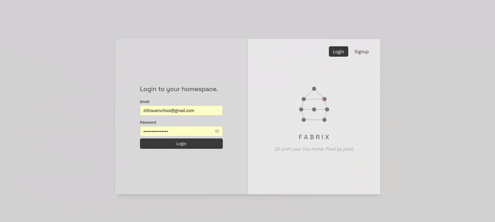

# FABRIX - Tiny Home 3D Printing
<div align="center">
<pre>
╱╲╲╲╲╲╲╲╲            ╱╲             ╱╲╲ ╱╲╲         ╱╲╲╲╲╲╲╲          ╱╲╲      ╱╲╲      ╱╲╲
╱╲╲                 ╱╲ ╲╲           ╱╲    ╱╲╲       ╱╲╲    ╱╲╲        ╱╲╲       ╱╲╲   ╱╲╲  
╱╲╲                ╱╲  ╱╲╲          ╱╲     ╱╲╲      ╱╲╲    ╱╲╲        ╱╲╲        ╱╲╲ ╱╲╲   
╱╲╲╲╲╲╲           ╱╲╲   ╱╲╲         ╱╲╲╲ ╱╲         ╱╲ ╱╲╲            ╱╲╲          ╱╲╲     
╱╲╲              ╱╲╲╲╲╲╲ ╱╲╲        ╱╲     ╱╲╲      ╱╲╲  ╱╲╲          ╱╲╲        ╱╲╲ ╱╲╲   
╱╲╲             ╱╲╲       ╱╲╲       ╱╲      ╱╲      ╱╲╲    ╱╲╲        ╱╲╲       ╱╲╲   ╱╲╲  
╱╲╲            ╱╲╲         ╱╲╲      ╱╲╲╲╲ ╱╲╲       ╱╲╲      ╱╲╲      ╱╲╲      ╱╲╲      ╱╲╲
                                                                                           
</pre>
</div>

## Concept
For this demo, I created a company called ***FABRIX***, a mock website that allows you to build and 3D print your tiny home.

<p align="center">
  
</p>

## Prerequisites

- [Docker](https://www.docker.com/)
- [Docker Compose](https://docs.docker.com/compose/)
- [Node.js](https://nodejs.org/) and [npm](https://www.npmjs.com/) if you want to run frontend tooling outside Docker
- [Go](https://go.dev/) if you want to run the backend locally without containers

## Getting Started

For the fastest local run:

1. Clone the repository

```bash
git clone https://github.com/connorzittrauer/CTEC-Demo.git
cd CTEC-Demo
```

2. Copy the backend environment file 


```bash
cp backend/.env.example backend/.env
```
*The backend and database read runtime settings from `backend/.env`*

3. Start the production-style Docker stack

```bash
docker compose up --build
```

4. Open the app locally

- Frontend: `http://localhost:5173`
- Backend: `http://localhost:8080`
- PostgreSQL: `localhost:5433`

5. Optional: run the development Compose stack instead if you want hot reload while editing locally

```bash
docker compose -f docker-compose.dev.yml up --build
```

6. Optional: open an interactive PostgreSQL shell

```bash
docker exec -it auth-db-dev psql -U postgres -d authdb
```

## Architecture Overview

FABRIX uses a simple three-service architecture:

- The React frontend handles routing, form state, and authenticated UI
- The Go backend exposes authentication endpoints using `net/http`
- PostgreSQL stores user records and is initialized from a startup SQL script

Authentication uses JWTs returned by the backend after login. The frontend attaches the token to protected requests, and the backend verifies both the token signature and the user record before returning authenticated data.

<div align="center">
<pre>
┌─────────┐    ┌─────────────────┐    ┌───────────────┐    ┌────────────────┐
│ Browser │ -> │ Frontend        │ -> │ Backend       │ -> │ PostgreSQL     │
│         │    │ React + TS      │    │ Go + net/http │    │ SQL database   │
│         │    │ Vite on :5173   │    │ API on :8080  │    │                │
└─────────┘    └─────────────────┘    └───────────────┘    └────────────────┘
</pre>
</div>
JWT flow:
token stored after login -> bearer token sent -> token verified


## Project Structure
```text
frontend/                  React + TypeScript client
  src/                     Pages, components, routing, API helpers
  public/                  Static assets

backend/                   Go authentication API
  handlers/                HTTP handlers
  middleware/              JWT/auth middleware
  models/                  Request/response data structures
  utils/                   Shared helpers
  config/                  Environment/config loading
  db/                      Database access logic

db/
  initialize.sql           PostgreSQL schema bootstrap

docker-compose.yml         Production-style local run
docker-compose.dev.yml     Development run with hot reload
ai-information.md          AI usage disclosure
```

## Runtime Configuration

Copy [backend/.env.example](backend/.env.example) to `backend/.env` before starting the project.

```bash
cp backend/.env.example backend/.env
```

| Variable | Purpose |
| --- | --- |
| `JWT_SECRET` | Secret used to sign and verify JWTs |
| `DATABASE_URL` | PostgreSQL connection string used by the backend |
| `CORS_ALLOWED_ORIGIN` | Frontend origin allowed to call the API |
| `POSTGRES_USER` | PostgreSQL username for container initialization |
| `POSTGRES_PASSWORD` | PostgreSQL password for container initialization |
| `POSTGRES_DB` | Default PostgreSQL database name |

## Database Initialization

The PostgreSQL container initializes the schema from [db/initialize.sql](db/initialize.sql).

Schema:

```sql
CREATE TABLE users (
    id SERIAL PRIMARY KEY,
    first_name TEXT NOT NULL,
    last_name TEXT NOT NULL,
    email TEXT UNIQUE NOT NULL,
    password TEXT NOT NULL,
    created_at TIMESTAMP DEFAULT CURRENT_TIMESTAMP
);
```

To reset the database:

```bash
docker compose down -v
```

## API Overview

### `POST /signup`

Creates a new user account.

Request body:

```json
{
  "first_name": "John",
  "last_name": "Doe",
  "email": "john@example.com",
  "password": "SecurePass1"
}
```

Behavior:

- Rejects malformed JSON and unknown fields
- Normalizes the email before validation and lookup
- Requires first name, last name, email, and password
- Enforces a password policy:
  - at least 8 characters
  - at least one uppercase letter
  - at least one lowercase letter
  - at least one number
- Hashes the password with bcrypt before storage

### `POST /login`

Authenticates an existing user and returns a JWT.

Request body:

```json
{
  "email": "john@example.com",
  "password": "SecurePass1"
}
```

Behavior:

- Rejects malformed JSON and unknown fields
- Normalizes the email before lookup
- Returns a signed JWT on successful authentication

### `GET /me`

Verifies the current authenticated user.

Header:

```text
Authorization: Bearer <JWT_TOKEN>
```

Behavior:

- Validates the JWT using the configured server secret
- Enforces the expected signing method
- Returns the authenticated email if the user still exists

### `POST /logout`

Returns a success response for the client logout flow. The frontend calls this endpoint and then removes the stored token locally.

## cURL Examples

### Signup

```bash
curl -X POST http://localhost:8080/signup \
  -H "Content-Type: application/json" \
  -d '{
    "first_name": "John",
    "last_name": "Doe",
    "email": "john@example.com",
    "password": "SecurePass1"
  }'
```

### Login

```bash
curl -X POST http://localhost:8080/login \
  -H "Content-Type: application/json" \
  -d '{
    "email": "john@example.com",
    "password": "SecurePass1"
  }'
```

### Authenticated Session Check

```bash
curl -X GET http://localhost:8080/me \
  -H "Authorization: Bearer <JWT_TOKEN>"
```

## Known Limitations

- Tokens are handled as a lightweight demo auth flow and are not backed by refresh-token rotation
- The project does not include password reset, email verification, or account recovery
- Logout is client-driven and removes the stored token locally rather than maintaining a server-side token revocation list
- The app is built as a challenge demo, so production concerns such as rate limiting, audit logging, and deeper observability are intentionally minimal

## Testing

Run backend tests in Docker:

```bash
docker compose down
docker compose run --build --rm backend go test -v ./...
```

Successful test output will look similar to:

```bash
=== RUN   TestSignupHandler
--- PASS: TestSignupHandler (0.08s)
=== RUN   TestLoginHandler
--- PASS: TestLoginHandler (0.09s)
PASS
ok      auth-app/handlers       0.017s
=== RUN   TestAuthMiddleware_ValidToken
--- PASS: TestAuthMiddleware_ValidToken (0.00s)
=== RUN   TestAuthMiddleware_NoToken
--- PASS: TestAuthMiddleware_NoToken (0.00s)
PASS
ok      auth-app/middleware     0.004s
```

Run frontend checks locally:

```bash
cd frontend
npm run build
npm run lint
```

## UI Design choices 
### Colors/Typography:
During the frontend design planning phase, I decided to go with an industrial color pallete to suggest a prefab + tech oriented theme:   
<table>
  <tr>
    <td bgcolor="#D3D3D3" width="24" height="24"></td>
    <td bgcolor="#E9E9E9" width="24" height="24"></td>
    <td bgcolor="#C0C0C0" width="24" height="24"></td>
    <td bgcolor="#D9DBDD" width="24" height="24"></td>
    <td bgcolor="#313131" width="24" height="24"></td>
    <td bgcolor="#3B3B3F" width="24" height="24"></td>
    <td bgcolor="#5A5A60" width="24" height="24"></td>
  </tr>
</table>

## Stack
- 
- 
- 
- 
- 
- 
- 
- 
- 


### Dev Tooling
- Developed on Ubuntu 24.04.4
- ZSH Shell
- Git CLI 
- Docker CLI
- VSCode

### Design References:
- [Stripe Login](https://dashboard.stripe.com/login)
  - Signup button vertical shift animation 
  - Signup button disabled on empty fields
- [Dribbble](https://dribbble.com/shots/4013348-Login-web-splitscreen)
  - Modal auth splitscreen design
- [Piktochart](https://piktochart.com/tips/industrial-color-palette)
  - Industrial color palette


## Future Features/Fixes
- There is minor bug that occurs when the user enters in an already registered email in /signup, an error message is thrown, and that error message carries over to the /login page
- Autocomplete of form fields performs worse in Chrome that in Firefox for some reason.
- Responsive Design for tablet/mobile
